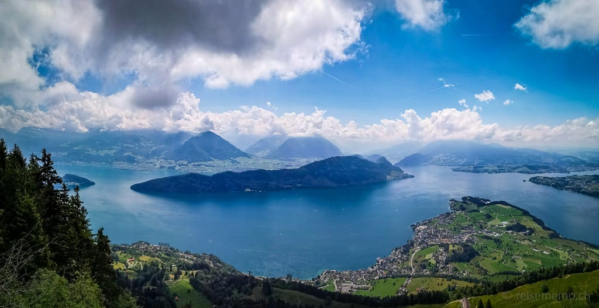

Suiza ofrece mucho más que esta lista, pero está restringida a:

- Están a 1h 30' como máximo de Zürich.
- Se pueden realizar en primavera.
- Aptas para carritos de bebes.
- Son las más representativas.

Todos los precios de transporte es ida y vuelta.

## Poblaciones

### Zürich

Nuestra ciudad cosmopolita con tiendas de lujo, paseo por el casco antiguo y cerca del lago.

- 8 EUR / tranvía día entero
- Tiempo visita: 4 / 6 horas
- [Más información](https://www.myswitzerland.com/es/destinos/zurich/)

### Lucerna

Lucerna con el puente cubierto más antiguo de Europa (del siglo XIV) en medio del casco antiguo.

- Tren desde Zürich: 40 min - 50 EUR
- Tiempo visita: 2 a 4 horas
- [Más información](https://www.myswitzerland.com/es/descubrir-suiza/kapellbruecke-y-wasserturm/)

### Berna

El casco urbano medieval de Berna es Patrimonio Mudial Cultural de la UNESCO. Se trata de la capital suiza. Podemos pasear por las calles medievales, ver el parlamento, donde vivió Albert Einstein, etc.

- Tren desde Zürich: 1h 20 min - 100 EUR
- Tiempo visita: 2 a 4 horas
- [Más información](https://www.myswitzerland.com/es/descubrir-suiza/casco-historico-de-berna/)

### Sankt Gallen

Pequeña población de 75k habitantes. El distrito capitular de Sankt Gallen con su catedral barroca, biblioteca y el archivo capitular es Patrimonio Mundial Cultural de la UNESCO.

- Tren desde Zürich: 1h 30 min - 70 EUR
- Tiempo visita: 2 a 4 horas
- [Más información](https://www.myswitzerland.com/es/descubrir-suiza/distrito-capitular-de-san-gall/)

## Actividades cerca de Zürich

### Fábrica de chocolate Lindt

Tour de chocolate, explica cómo se hace el chocolate y podemos luego degustarlo.

- Tren desde Zürich: 15 min - 10 EUR
- Entrada museo + degustación: 25 EUR
- Tiempo visita: 1 a 2 horas
- [Más información](https://www.lindt-home-of-chocolate.com/en/chocolate-museum-tour/)

### Museo FIFA

El museo presenta la interesante historia del fútbol internacional, hace un recorrido por las grandes competiciones

- En Zürich
- Entrada museo + degustación: 22 EUR
- Tiempo visita: 1 a 2 horas
- [Más información](https://www.fifamuseum.com/en/exhibitions-events/the-exhibition/)

### Castillo de Lenzburg

Una de las fortalezas más importantes de Suiza, origen de la casa Hasburgo (casa Austria) que terminarían gobernando media Europa incluyendo España.
Es un castillo muy bien mantenido, cada piso reproduce con mucho detalle cómo vivía la gente a lo largo de los siglos.

- Tren desde Zürich: 1h - 60 EUR
- Entrada: 10 EUR
- Tiempo visita: 2 a 4 horas
- [Más información](https://www.myswitzerland.com/es/descubrir-suiza/castillo-de-lenzburg-un-castillo-de-caballeros-y-dragones/)

## Naturaleza

### Lago Lucerna

Este lago es tan grande que se le llama el "Lago de los Cuatro Cantones", hay recorridos en barco entre 1h a 5h saliendo de Lucerna.

- Tren desde **Lucerna**: 0 min
- Opciones
  - [Crucero catamarán](https://www.lakelucerne.ch/en/your-cruise-experience/offers-tickets/round-trips/1h-buergenstock-round-cruise/) 1 h -> 25 EUR
  - [Crucero corto](https://www.lakelucerne.ch/en/your-cruise-experience/offers-tickets/round-trips/short-lake-cruise/) 2.5 -> 86 EUR
  - [Grandes lagos](https://www.lakelucerne.ch/en/your-cruise-experience/offers-tickets/round-trips/great-lake-cruise/) 5.5 h -> 115 EUR
- [Más información](https://www.myswitzerland.com/es/destinos/lago-de-los-cuatro-cantones/)

### Rigi

Para ver los Alpes desde la distancia. Pico a 1700 msnm, situado cerca de Lucerna, está en la zona prealpina, por eso las vistas se dividen entre los tres lagos y los Alpes. Acceso por tren de cremallera.

- Tren desde Zürich: 1h 30 min - 115 EUR
- Tiempo visita: 1 hora
- [Más información](https://rigi.roundshot.com/#/)

### Braunwald

Para sumergirse en medio de los Alpes. Braunwald es un pueblo a 1300 msnm situado en medio de los Alpes orientales con una vista espectacular. Se llega fácilmente con tren y luego tren cremallera.

- Tren desde Zürich: 1h 40 min - 60 EUR
- Tiempo visita: 1 hora
- [Más información](https://braunwald.ch/de/aktuell/webcams-wetter.html)

### Pilatus

Perfecto si queremos ver los Alpes desde arriba. Pico importante a 2100 msnm, tocando con Lucerna. Se puede subir en teleférico o tren cremallera (depende de la temporada de nieve).

- Teleférico desde **Lucerna**: 30 min - 36 EUR
- Tiempo visita: 1 hora
- [Más información](https://www.myswitzerland.com/es/descubrir-suiza/pilatus/)

### Las cataratas del Rin

El salto de agua más grande de Europa está en las cataratas del Rin en Schaffhausen, frontera con Alemania.

- Tren desde Zürich: 40 min - 50 EUR
- Barco (opcional) 20 EUR
- Tiempo visita: 1 hora
- [Más información](https://www.myswitzerland.com/es/descubrir-suiza/las-cataratas-del-rin/) - [Ruta barco](https://rheinfall.ch/en/attractions/attractions/attractions.html)

### Uetliberg

Pequeña montaña junto a Zürich. Para ver la ciudad y el lago Zürich desde arriba.

- Tren desde Zürich: 15 min - 10 EUR
- Tiempo visita: 1 a 2 horas
- [Más información](https://www.utokulm.ch/en/uetliberg)
